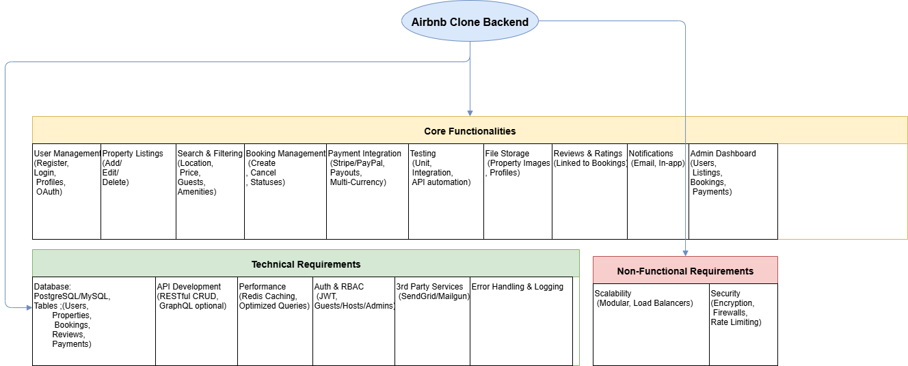

# Airbnb Clone – Features & Functionalities

This document outlines the key features and functionalities for the Airbnb Clone backend project, categorized into Core Functionalities, Technical Requirements, and Non-Functional Requirements.

---

## Core Functionalities
1. **User Management**
   - Register as guest or host with JWT authentication
   - Login with email/password + OAuth (Google, Facebook)
   - Profile update (photo, contact info, preferences)

2. **Property Listings**
   - Add, edit, delete property listings
   - Property details: title, description, location, price, amenities, availability

3. **Search & Filtering**
   - Search by location, price, guests, amenities
   - Pagination for large datasets

4. **Booking Management**
   - Create bookings with date validation
   - Cancel bookings (guest or host)
   - Booking statuses: pending, confirmed, canceled, completed

5. **Payments**
   - Stripe/PayPal integration
   - Guest payments & host payouts
   - Multi-currency support

6. **Reviews & Ratings**
   - Guests leave reviews linked to bookings
   - Hosts can reply

7. **Notifications**
   - Email & in-app notifications for bookings, cancellations, payments

8. **Admin Dashboard**
   - Manage users, listings, bookings, payments

---

##  Technical Requirements
- **Database**: PostgreSQL/MySQL with Users, Properties, Bookings, Reviews, Payments tables
- **API**: RESTful CRUD operations, GraphQL optional
- **Auth**: JWT sessions with role-based access control
- **File Storage**: Property images & profile photos (local/cloud)
- **3rd-Party Services**: SendGrid/Mailgun for emails
- **Error Handling & Logging**: Global error handling and structured logs

---

##  Non-Functional Requirements
- **Scalability**: Modular architecture, load balancing
- **Security**: Encrypted data, firewalls, rate limiting
- **Performance**: Redis caching, optimized queries
- **Testing**: Unit, integration, and automated API tests

---

##  Diagram
Below is the visual overview of the Airbnb Clone backend features:

!# Airbnb Clone – Features & Functionalities

This document outlines the key features and functionalities for the Airbnb Clone backend project, categorized into Core Functionalities, Technical Requirements, and Non-Functional Requirements.

---

##  Core Functionalities
1. **User Management**
   - Register as guest or host with JWT authentication
   - Login with email/password + OAuth (Google, Facebook)
   - Profile update (photo, contact info, preferences)

2. **Property Listings**
   - Add, edit, delete property listings
   - Property details: title, description, location, price, amenities, availability

3. **Search & Filtering**
   - Search by location, price, guests, amenities
   - Pagination for large datasets

4. **Booking Management**
   - Create bookings with date validation
   - Cancel bookings (guest or host)
   - Booking statuses: pending, confirmed, canceled, completed

5. **Payments**
   - Stripe/PayPal integration
   - Guest payments & host payouts
   - Multi-currency support

6. **Reviews & Ratings**
   - Guests leave reviews linked to bookings
   - Hosts can reply

7. **Notifications**
   - Email & in-app notifications for bookings, cancellations, payments

8. **Admin Dashboard**
   - Manage users, listings, bookings, payments

---

## Technical Requirements
- **Database**: PostgreSQL/MySQL with Users, Properties, Bookings, Reviews, Payments tables
- **API**: RESTful CRUD operations, GraphQL optional
- **Auth**: JWT sessions with role-based access control
- **File Storage**: Property images & profile photos (local/cloud)
- **3rd-Party Services**: SendGrid/Mailgun for emails
- **Error Handling & Logging**: Global error handling and structured logs

---

## Non-Functional Requirements
- **Scalability**: Modular architecture, load balancing
- **Security**: Encrypted data, firewalls, rate limiting
- **Performance**: Redis caching, optimized queries
- **Testing**: Unit, integration, and automated API tests

---

## 📊 Diagram
Below is the visual overview of the Airbnb Clone backend features:

!
