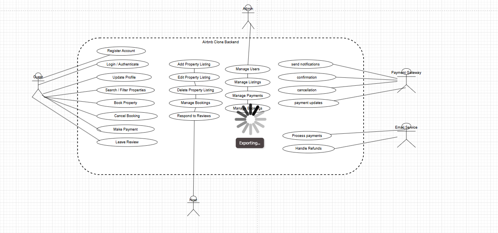

# Airbnb Clone – Use Case Diagram

This diagram visualizes the interactions between different actors (users and external systems) and the Airbnb Clone backend.

---

## 🎭 Actors
- **Guest**: Registers, logs in, searches properties, books, cancels, pays, leaves reviews.
- **Host**: Registers, manages listings, manages bookings, responds to reviews.
- **Admin**: Manages users, listings, bookings, and payments.
- **Payment Gateway**: Processes guest payments and host payouts.
- **Email Service**: Sends booking confirmations, cancellations, and payment updates.

---

## 🔑 Key Use Cases
- **User Management**: Registration, login, profile update.
- **Property Management**: Add, edit, delete listings.
- **Search & Booking**: Search/filter listings, book properties, cancel bookings.
- **Payments**: Process payments, handle refunds, multi-currency support.
- **Reviews & Ratings**: Leave and respond to reviews.
- **Admin Control**: Manage platform resources.
- **Notifications**: Email and in-app notifications.

---

## 📊 Diagram
Below is the Use Case Diagram for the Airbnb Clone backend:

